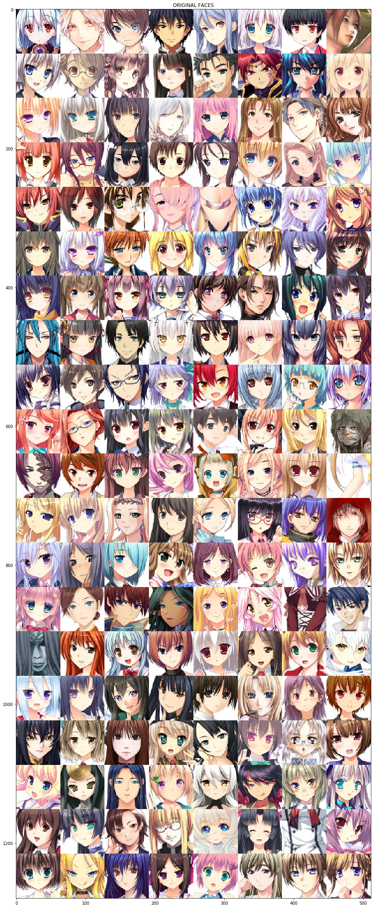
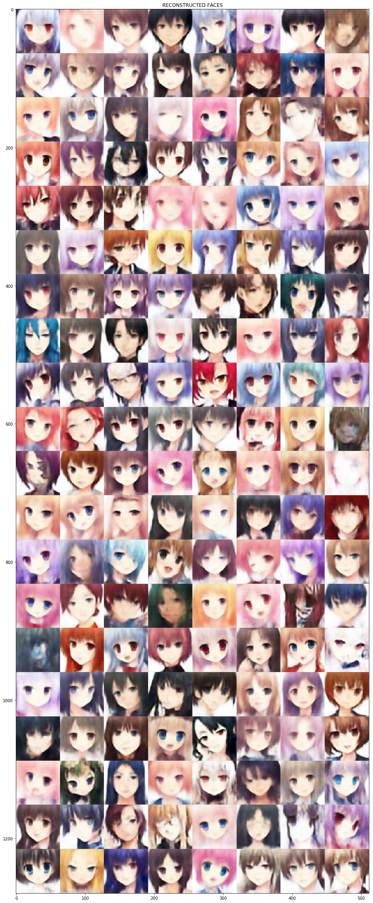

# FaceGenerationUsingVariationalAutoencoder
VARIATIONAL AUTOENCODERS are Generative model. A Generative Model is a powerful way of learning any kind of data distribution using unsupervised learning and it has achieved tremendous success over the past few years. All types of generative models aim at learning the true data distribution of the training set so as to generate new data points with some variations. But it is not always possible to learn the exact distribution of our data either implicitly or explicitly and so we try to model a distribution which is as similar as possible to the true data distribution. For this, we can leverage the power of neural networks to learn a function which can approximate the model distribution to the true distribution.
In this project I built Variational Autoencoder to generate new set of images. I have been working on this project since the last four weeks. I faced lot of struggles in building this. I faced the following struggles, 
1) I didn't have huge computational source
2) Struggled with the memory problem(RAM,GPU etc). Even I tried various Google Collab hacks lol.
3) I couldn't find the dataset I desired(I wanted human face dataset)
4) The face image dataset that I found was 600*600*3. I wanted images of size 64*64*3 so that I can reduce the cost of computation.

Finally I found this Anime dataset with 64*64*3 images.
 
 # How Variational Autoencoders generate data(images)?
 VAE as two parts, encoder and a decoder.Between the encoder and the decoder there is a space called Latent space which is a distribution Encoder encodes the input image into two disributions that is, Standand deviation and Mean. Then these to distributions are fed into the decoder to generate images. From the latent space a compressed image can be generated(reconstructed image). In this project I have used two loss functions, Mean squared error and Kullback–Leibler divergence loss. KL-Divergence calculates distance between the two distributions and makes sures the distance is small(Mean and standard deviation). Mean squared error penalizes the reconstructed image to make sire it retains all the important features. I know all these things are abstruse. If interested then do learn!
 
 # Output
 # Original faces
 
 
 # Reconstructed faces

# Genrated faces

